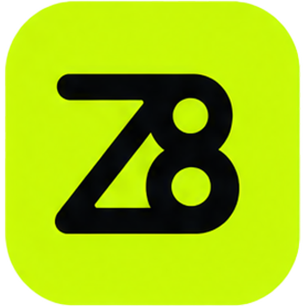

# Z8 Codex

Z8 Codex is an account, provider, and launch manager for the official Codex desktop app. It uses the official desktop app as the session host while managing Z8 accounts, API keys, provider settings, usage information, and launch workflows locally. Optional Codex UI enhancements are also available.

<p align="center">
  
</p>

<p align="center">
  <a href="https://z8.hk/">Z8 website</a> ·
  <a href="https://github.com/z8infra/z8-codex">Project repository</a> ·
  <a href="https://github.com/BigPizzaV3/CodexPlusPlus">Upstream project</a> ·
  <a href="LICENSE">AGPL-3.0-only</a>
</p>

## Project Origin and License

This project is a derivative work based on [BigPizzaV3/CodexPlusPlus](https://github.com/BigPizzaV3/CodexPlusPlus) and is distributed under the GNU Affero General Public License v3.0 (SPDX: `AGPL-3.0-only`). Z8 Codex adds Z8 branding, account workflows, provider configuration, usage display, desktop installation, and launch management on top of the upstream project.

When distributing this project, retain [LICENSE](LICENSE) and [THIRD_PARTY_NOTICES.md](THIRD_PARTY_NOTICES.md), and provide the corresponding source code as required by AGPL-3.0-only. The source tree and commit history identify the applicable modifications.

Z8 Codex is not affiliated with, endorsed by, or officially authorized by OpenAI, ChatGPT, or Codex. OpenAI, ChatGPT, Codex, and related marks belong to their respective owners.

## Feature Overview

### Z8 Account

- Sign in, register, sign out, and manage account status.
- Manage multiple API keys and write the selected key to the Z8 provider.
- View available balance, daily requests, token usage, and cumulative spend as returned by the service.
- Redeem credits and open the official Z8 recharge page.

### Providers and Models

- Configure pure API, official-login-plus-API, and aggregate providers.
- Support Responses API and Chat Completions protocols.
- Configure Base URL, API key, model lists, test models, context windows, and auto-compact limits.
- Run provider health checks and model tests, with failover, round-robin, and weighted routing.

### Codex Desktop Management

- Detect the local Codex desktop app and save its path.
- Download or select a local Codex desktop mirror.
- Start, restart, and diagnose Codex while preventing duplicate launches of the same instance.
- Synchronize account and provider settings with the local Codex configuration.

### Optional Enhancements

- Session scanning, bulk deletion, Markdown export, and token usage history.
- Plugins, Skills, MCP, model whitelists, paste fixes, and forced Chinese UI.
- Conversation width, scroll restoration, thread IDs, service tiers, and Goals.
- Logs, health checks, configuration backups, and diagnostics.

Enhancements can be disabled independently. With enhancements disabled, Z8 Codex remains an account, provider, and launch manager.

## Installation and First Use

### Install the Official Codex Desktop App

Z8 Codex requires the official Codex desktop app to be installed locally before it can start a session. Open “Installation & Maintenance” in the manager to check the application path and version. If it is not installed, use a Z8 mirror or an official distribution channel, then run detection again.

### Install Z8 Codex

Internal test packages are provided for each supported platform and architecture:

- Windows x64: `Z8Codex-*-windows-x64-setup.exe`
- Windows ARM64: `Z8Codex-*-windows-arm64-setup.exe`
- macOS Intel: `Z8Codex-*-macos-x64.dmg`
- macOS Apple Silicon: `Z8Codex-*-macos-arm64.dmg`

After installation, open “Z8 Codex Manager” and:

1. Sign in or create a Z8 account.
2. Select an API key and confirm that the Z8 provider is reachable.
3. Check account usage and the local Codex desktop app path.
4. Click “Start Codex” to open a session.

The first launch may take longer on lower-spec devices. The launch button remains locked while a launch task is in progress so repeated clicks do not open multiple Codex instances.

## Local Data

Z8 Codex stores configuration, cache, logs, and backups in the local user directories. Common locations include:

- Codex configuration: `~/.codex/config.toml`
- Codex login state: `~/.codex/auth.json`
- Codex database: prefers `~/.codex/sqlite/*.db`, with a fallback to `~/.codex/state_5.sqlite`
- Z8 Codex state and logs: `~/.codex-session-delete/`
- Provider sync backups: `~/.codex/backups_state/provider-sync`

API keys and login information are sensitive. Do not publish configuration files, logs, screenshots, or exported diagnostics in public channels.

## Build from Source

### Common Requirements

- Node.js 22 or a compatible version
- npm
- Rust stable toolchain
- Git

### Windows

Install NSIS, then run:

```powershell
npm ci --prefix apps/codex-plus-manager
npm run vite:build --prefix apps/codex-plus-manager
cargo build --release --locked --target x86_64-pc-windows-msvc
```

The installer script is `scripts/installer/windows/CodexPlusPlus.nsi`. For ARM64, use the `aarch64-pc-windows-msvc` Rust target and the `arm64` installer argument.

### macOS

Build macOS packages on a native macOS environment with Xcode Command Line Tools. The packager requires `codesign`, `hdiutil`, `lipo`, `sips`, and `iconutil`:

```bash
npm ci --prefix apps/codex-plus-manager
npm run vite:build --prefix apps/codex-plus-manager
cargo build --release --locked --target x86_64-apple-darwin
MACOS_BUILD_NUMBER=local BINARY_DIR="$PWD/target/x86_64-apple-darwin/release" \
  bash scripts/installer/macos/package-dmg.sh 1.3.2 x64
```

For Apple Silicon, use `aarch64-apple-darwin` and the `arm64` argument. Internal packages use temporary signing and are not Developer ID signed or notarized release packages.

### Automated releases

GitHub Actions creates a GitHub Release when a strict version tag such as `v1.3.3` is pushed. It builds four installers: Windows x64, Windows ARM64, macOS Intel, and macOS Apple Silicon. It also uploads the source archive, license, third-party notices, SHA-256 checksums, and `latest.json`.

Before releasing, keep these three version values equal to the same `X.Y.Z`:

- the workspace version in the root `Cargo.toml`
- `version` in `apps/codex-plus-manager/package.json`
- `version` in `apps/codex-plus-manager/src-tauri/tauri.conf.json`

Commit and push the version change, then push the tag:

```bash
git tag v1.3.3
git push origin v1.3.3
```

The workflow validates the tag and all three version values and stops before publishing if they differ. Windows installers are currently unsigned, and macOS packages require Apple Developer ID signing and notarization credentials for formal signed distribution.

## FAQ

### The Start Codex button does nothing

Confirm the Codex desktop app path in “Installation & Maintenance”, close any running Codex instance, and try again. The manager checks existing processes, launch state, and the debug port before starting a new instance.

### Requests fail after switching providers

Run a health check and model test on the provider detail page. Confirm that the protocol, Base URL, API key, and test model match. Responses API and Chat Completions settings must not be mixed.

### macOS says the app cannot be opened

Unsigned internal packages may require approval in System Settings -> Privacy & Security. Formal distribution should use Developer ID signing and Apple notarization.

## Related Files

- [Upstream CodexPlusPlus](https://github.com/BigPizzaV3/CodexPlusPlus)
- [GNU AGPL v3.0 License](LICENSE)
- [Third-party notices](THIRD_PARTY_NOTICES.md)
- [Z8 website](https://z8.hk/)
